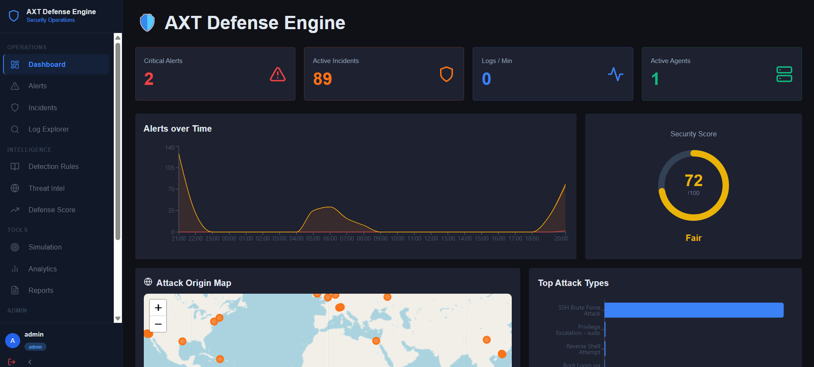
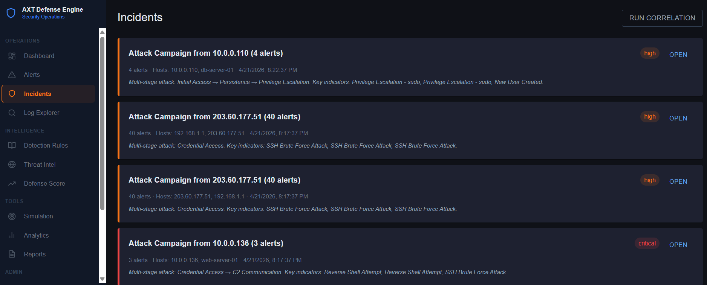
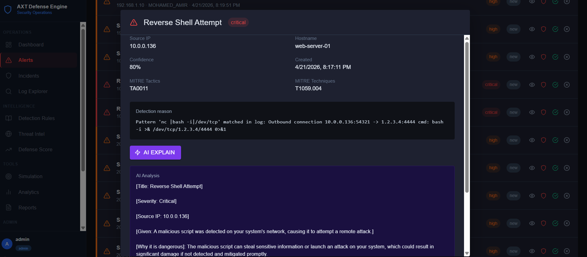
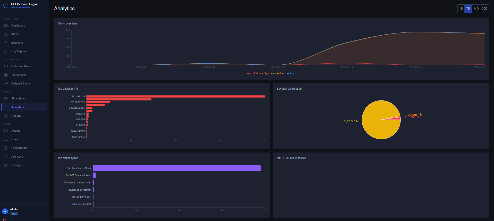

# AXT Defense Engine  
### Custom SIEM Platform for Real-Time Threat Detection & SOC Operations

---

## 📌 Overview

AXT Defense Engine is a **custom-built SIEM (Security Information and Event Management) platform** designed to replicate real-world Security Operations Center (SOC) workflows.

Inspired by enterprise SIEM solutions like **Splunk and IBM QRadar**, this project focuses on:

- Real-time threat detection  
- Log analysis and correlation  
- Incident investigation  
- MITRE ATT&CK-based detection  

---

## 🚀 Project Highlights

- Built a working SIEM system simulating real SOC operations  
- Implemented detection for **SSH brute force and reverse shell attacks**  
- Designed alert correlation for **multi-stage attack detection**  
- Integrated **MITRE ATT&CK mapping** for threat classification  

---

## 🎯 Key Achievements

- Built a custom SIEM platform for **real-time threat detection**
- Simulated attacks such as **SSH brute force and reverse shell**
- Implemented **MITRE ATT&CK-based detection rules**
- Developed **incident correlation system for multi-stage attacks**
- Created **real-time dashboards for monitoring and analysis**

---

## 🔍 Core Features

### 🛡️ Threat Detection
- Detection of brute force attacks, reverse shells, and suspicious activities  
- Pattern-based and threshold-based detection logic  
- Alerts mapped to **MITRE ATT&CK techniques**

### 📊 Log Analysis
- Centralized log collection and normalization  
- Real-time log monitoring and filtering  

### 🔗 Incident Correlation
- Groups multiple alerts into a single incident  
- Identifies multi-stage attack patterns  

### 📈 Analytics Dashboard
- Alerts over time  
- Top attacker IPs  
- Attack type distribution  

---

## 🏗️ Architecture

Log Sources (Linux / Network)
↓
Log Collection & Normalization
↓
Detection Engine (Rules + MITRE ATT&CK)
↓
Alert Generation
↓
Incident Correlation
↓
Dashboard & Analytics (React)

---

## 🛠️ Tech Stack

- **Backend:** Python, FastAPI  
- **Frontend:** React  
- **Database:** PostgreSQL  
- **Other:** Linux, Networking, MITRE ATT&CK  

---

## 📸 Screenshots

### Dashboard

### Incident Correlation

### Alert Analysis (Reverse Shell Detection)

### Analytics Dashboard

---

## 🔐 Security Note

This project is built for **educational and demonstration purposes**.  
All attack simulations are performed in a controlled environment.

---

## 👨‍💻 Author

**Mohamed Amir M**  
Cybersecurity Analyst | SOC | VAPT  

- CEH (EC-Council)  
- CPT | CICSA | Certified RedTeam Instructor  
- Recognized by NCIIPC for vulnerability disclosure  

🔗 LinkedIn: https://www.linkedin.com/in/mohdamir32/
🔗 **Repository:** https://github.com/DRAGZO303/Axt-Defense-Engine

---

## ⭐ If you found this useful, consider giving it a star!
